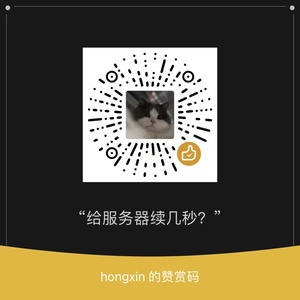

# Arxiv Daily -- Miniapp on Wechat

A fast way to track the latest research papers on mobile devices.
 
See detailed introduction on [Zhihu](https://zhuanlan.zhihu.com/p/76578218).

## How to use

1. Search the Miniapp on Wechat by the chinese name: Arxiv今日速报.
2. Scan the barcode in the below:

## Sponsorship

Your sponsorship will help us provide fast, reliable service to our users by covering ourproject's server costs. By supporting our open-source software, you enable us tocontinue delivering value to the community. To sponsor us, please scan the barcode in the below. Thank you for your generous support.

